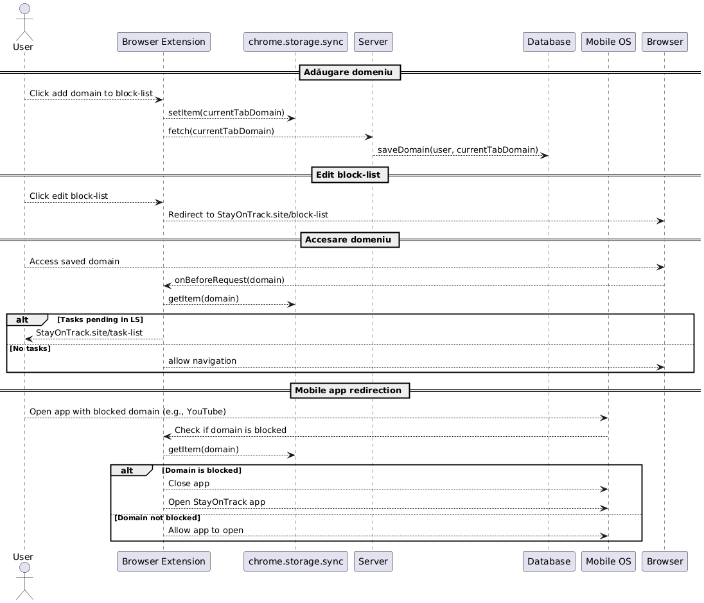
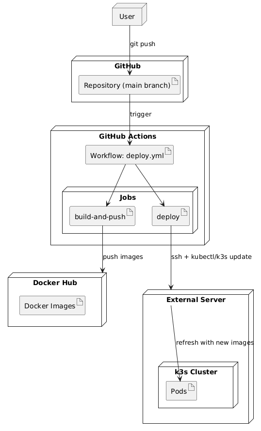
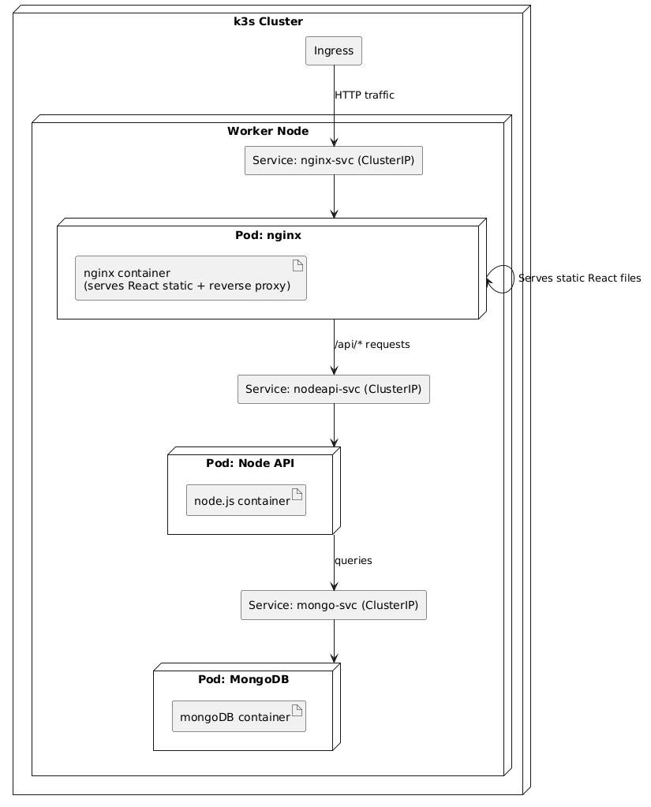

# StayOnTrack

**StayOnTrack** este o aplicație disponibilă ca extensie de browser, aplicație mobilă și web app.
Scopul său este să reducă distragerile zilnice, prin blocarea site-urilor și aplicațiilor introduse de utilizator (pe calculator sau telefon), până la finalizarea task-urilor din ziua respectivă.

---

## 🚀 Tehnologii folosite
- **Frontend (Web):** React  
- **Backend:** Node.js cu Express  
- **Bază de date:** MongoDB  
- **Containerizare:** Docker + Docker Compose  
- **Orchestrare:** Kubernetes (k3s)  
- **CI/CD:** GitHub Actions + Git

---

## 🏗️ Arhitectura generală
Aplicația urmează modelul **client-server**:
- **Client:** aplicația React Web care oferă interfața utilizatorului.
- **Server:** aplicația Node.js cu Express care expune un set de API-uri REST și gestionează logica aplicației.
- **Bază de date:** MongoDB, pentru stocarea utilizatorilor, task-urilor și listelor de site-uri blocate.

---

## 📊 Diagrama interacțiunilor
Următoarea diagramă prezintă principalele fluxuri ale aplicației StayOnTrack: adăugarea unui domeniu în block-list, editarea listei, accesarea unui domeniu blocat în browser și redirecționarea aplicațiilor mobile către StayOnTrack.



---

## 🔧 Instalare și rulare (local)

### Cerințe
- [Docker](https://docs.docker.com/get-docker/) instalat  
- [Docker Compose](https://docs.docker.com/compose/) instalat

### Pași
1. Clonează proiectul:
```bash
git clone <repo-url>
cd STAYONTRACK
```
2. Rulează aplicația și așteaptă să pornească serverele:
```bash
docker compose up
```
3. Pentru utilizarea extensiei de browser: citește README-ul din directorul `extension`.

### 🔑 Configurare autentificare Google
Pentru a folosi opțiunea de **Login cu Google**, creează credențiale OAuth 2.0 din Google Cloud Console:
1. Accesează: [Google Cloud Console](https://console.cloud.google.com/auth/clients)  
2. Creează un proiect nou sau folosește unul existent.  
3. Mergi la **APIs & Services → Credentials** și adaugă un nou **OAuth 2.0 Client ID**.  
4. Configurează tipul aplicației ca **Web application** și adaugă:
   - Authorized JavaScript origins: `http://localhost:80`
   - Authorized redirect URIs: `http://localhost:80/api/auth/google/callback`
5. După crearea credențialelor, vei primi un **Client ID** și un **Client Secret**.  
Creează un fișier `.env` în directorul `server` și adaugă:
```env
GOOGLE_CLIENT_ID=your-client-id
GOOGLE_CLIENT_SECRET=your-client-secret
GOOGLE_CALLBACK_URL=http://localhost:5000/auth/google/callback
```

---

## 📂 Structura proiectului
```
.github         -> workflow-ul de deployment (GitHub Actions)
assets          -> resurse (diagrame, imagini)
client          -> aplicația React (frontend web)
server          -> backend Node.js + Express
extension       -> extensia de browser
k3s             -> fișierele de deployment pentru k3s
```

---

## 🗃️ Model de date
Toate datele sunt stocate într-o singură colecție `users`, care conține datele utilizatorului, task-urile și site-urile blocate. Denormalizarea permite obținerea rapidă a stării unui utilizator.

Exemplu de document în `users`:
```json
{
  "userId": "abc123",
  "tasks": [
    { "id": 1, "title": "Finish report", "completed": false }
  ],
  "blockedSites": [
    "facebook.com",
    "youtube.com"
  ]
}
```

---

## 🧪 Testare
Testele pot fi rulate cu Playwright:
```bash
npx playwright test
```
Testele verifică:
- Pornirea serverului
- Autentificarea
- Adăugarea unui site în block-list și persistența acestuia după refresh

---

## ☁️ Deployment
Proces automatizat cu **GitHub Actions**:
1. Se construiește aplicația React → build static servit de Nginx
2. Se creează o imagine Docker pentru backend (Node.js)
3. Ambele imagini sunt urcate pe Docker Hub
4. Pe serverul de producție: workflow-ul se conectează prin SSH, actualizează imaginile și clusterul k3s reîmprospătează pod-urile.




